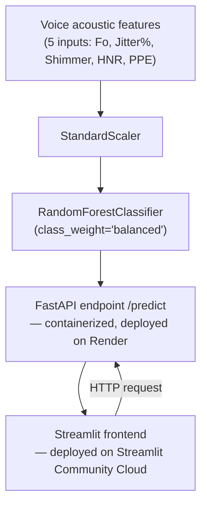

# 🎙️ Parkinson's Voice Screening

A machine learning screening tool that flags acoustic voice patterns associated with Parkinson's disease — served as a containerized API with a simple web frontend. Built as a corrected, production-grade rebuild of an earlier internship project.

**Live app:** https://pd-voice-screening-baffxyy.streamlit.app
**Live API:** https://pd-voice-screening.onrender.com/docs

> Note: the backend runs on a free-tier host and spins down after 15 minutes of inactivity — the first request after idle time may take 30–50 seconds to respond while it wakes up.

## What it does

Parkinson's disease affects motor control, including the muscles used for speech, often before other symptoms become obvious. This tool takes acoustic voice measurements and returns a risk indicator based on a model trained on the UCI Parkinson's voice dataset.

**This is a screening aid, not a diagnostic tool.** It's designed to flag patterns worth discussing with a doctor — not to replace clinical diagnosis. This distinction is enforced in the API response itself, not just in documentation.

## Why this project exists

I originally built a Parkinson's detection model during a 2023 internship ([old version here](https://github.com/Baffxy/Detection-of-the-Parkinsons-Disease)), using the 754-feature `pd_speech_features` dataset and an XGBoost classifier. Revisiting it, I found real methodological problems:

- Class imbalance (~3:1, 564 vs. 192) was never handled — the confusion matrix shows it: only 59/93 healthy individuals were correctly identified (63% recall), while 293/302 Parkinson's cases were (97% recall)
- Accuracy was the only reported metric (89%), which hid that lopsided per-class performance
- No cross-validation — a single train/test split with unverified reliability
- 754 raw features used with no feature selection or dimensionality reduction
- No reproducible artifacts — the model only existed inside a notebook session, never saved

Rather than patch that specific pipeline, I rebuilt the problem from scratch using a different, smaller, and more interpretable dataset — the classic 195-sample UCI Parkinson's voice dataset (22 acoustic features: jitter, shimmer, HNR, PPE, etc.) — because its features are the kind that could realistically be extracted from a short recorded voice sample, making an eventual real-world tool actually feasible. On top of that, I applied the fixes the original was missing: explicit class imbalance handling, cross-validation, and justified feature selection.

## What changed, concretely

| | Original (2023, `pd_speech_features`, XGBoost) | This version (UCI voice dataset, RandomForest) |
|---|---|---|
| Dataset | 754 features, 756 samples | 22 features, 195 samples |
| Class imbalance | Not handled | `class_weight='balanced'`, compared against baseline |
| Evaluation | Accuracy only (89%) | Precision/recall/F1 per class, ROC-AUC, macro-recall |
| Validation | Single train/test split | Stratified 5-fold cross-validation |
| Feature selection | None (all 754 raw features used) | Compared 5 vs. all 22 features via cross-validated F1 |
| Healthy-person recall | 63% (59/93 — missed 37% of healthy people) | 100% on held-out test set (10/10) |
| Deployment | None (notebook only) | FastAPI + Docker + Streamlit frontend, both live |

## Architecture



The API and frontend are decoupled and deployed separately — the frontend calls the live API over HTTP exactly as any other client (mobile app, another service) would.

## Key engineering decisions

- **`class_weight='balanced'` over resampling** — chosen after comparing against the unweighted baseline; directly addresses the 3:1 class imbalance without synthetic data.
- **Recall (macro), not just accuracy, as the deciding metric** — accuracy alone hid the original model's bias toward one class. Macro recall surfaces it immediately.
- **5-feature set retained over all 22** — not by default, but because cross-validated F1 showed it performs comparably, and it's a smaller, more practical set to eventually extract from a short voice recording.
- **Docker layer-per-package** — dependencies are installed in separate `RUN` layers rather than one `pip install -r requirements.txt` call, so a slow/failed download during build doesn't force re-downloading already-successful packages.

## Stack

Python · scikit-learn · FastAPI · Docker · Streamlit · joblib

## Running it locally

**Backend (API):**
```bash
git clone https://github.com/Baffxy/pd-voice-screening.git
cd pd-voice-screening
python -m venv venv
source venv/Scripts/activate   # or venv/bin/activate on Mac/Linux
pip install -r requirements.txt
uvicorn main:app --reload
```
API docs available at `http://127.0.0.1:8000/docs`

**Or via Docker:**
```bash
docker build -t pd-voice-api .
docker run -p 8000:8000 pd-voice-api
```

**Frontend** (in a separate terminal, with the API running):
```bash
streamlit run frontend.py
```

## Retraining the model

```bash
python train_model.py
```

This downloads the dataset directly from UCI, runs the full comparison (5 features vs. all 22, cross-validated), and saves `parkinsons_voice_model.pkl`, `scaler.pkl`, and `model_metadata.json` documenting exactly what was used and why.

## Raw audio input

The `/predict-audio` endpoint accepts a `.wav` recording directly (ideally a few seconds of a sustained vowel, e.g. "ahhh") and extracts the 5 acoustic features automatically using `parselmouth` (a Python wrapper around Praat), instead of requiring manual numeric entry.

**Note on PPE specifically:** unlike the other 4 features, Pitch Period Entropy has no built-in Praat function — it's a specific statistic from the original research paper (Little et al., 2007). The implementation here is a documented *approximation* (entropy of the normalized log pitch-period distribution), not a byte-for-byte reproduction of the paper's exact computation.

## Known limitations

- **Recording hardware quality matters, and can produce false positives:** an initial self-recorded test (own laptop) produced a high-confidence false positive on a presumably healthy voice. Investigating further, this was traced to a malfunctioning laptop microphone — not a general problem with non-clinical recordings. To confirm, I tested against 2 samples from an independent, peer-reviewed dataset — [Prior et al., 2023](https://doi.org/10.6084/m9.figshare.23849127), *Scientific Reports* — recorded via participants' own telephones (functioning hardware). Both were classified correctly (a PD-labeled sample at 98.5%, a healthy-labeled sample at 30%), consistent with the hypothesis that the earlier false positive was a hardware artifact rather than a fundamental limitation of the acoustic feature approach. This still means the tool is sensitive to input recording quality — a genuinely faulty or very low-quality microphone can distort jitter/shimmer/HNR enough to produce a misleading result — so recording equipment should be verified as functioning normally before relying on a result.
- **Small training dataset:** 195 samples total. Cross-validation gives a more trustworthy estimate than a single split, but the dataset is still small relative to the acoustic feature space.
- **PPE approximation:** see above.

## Possible extensions

- Basic recording-quality validation before extraction (e.g. flagging clipped audio, excessive noise, or unusually low signal) to catch hardware issues rather than silently returning a misleading prediction
- Systematic validation across a larger, varied set of externally-recorded samples (different devices, environments) to properly characterize reliability rather than relying on a handful of spot checks
- Persistent logging of predictions for monitoring/drift detection
- Orchestrated retraining pipeline (e.g. Prefect) for reproducible model updates